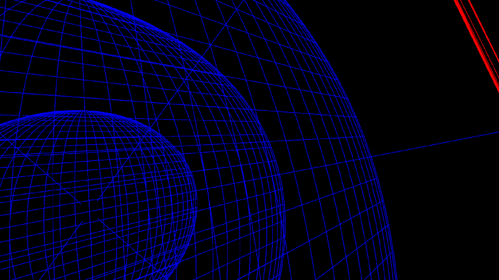

# Glome Projection
Project 4D sphere onto 2D screen.

# Reference
- https://math.stackexchange.com/questions/1402362/can-rotations-in-4d-be-given-an-explicit-matrix-form
- https://en.wikipedia.org/wiki/Spherical_coordinate_system
- http://hi.gher.space/forum/viewtopic.php?t=78

